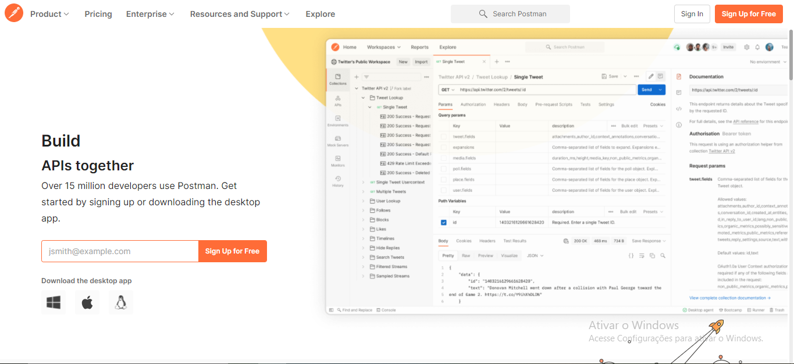
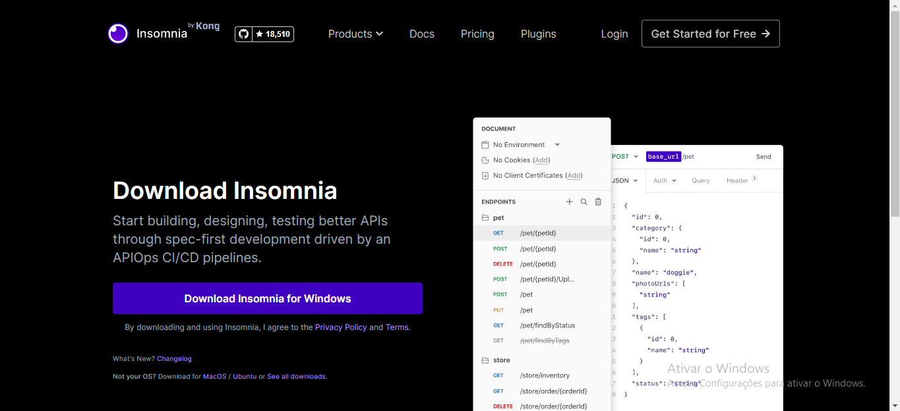
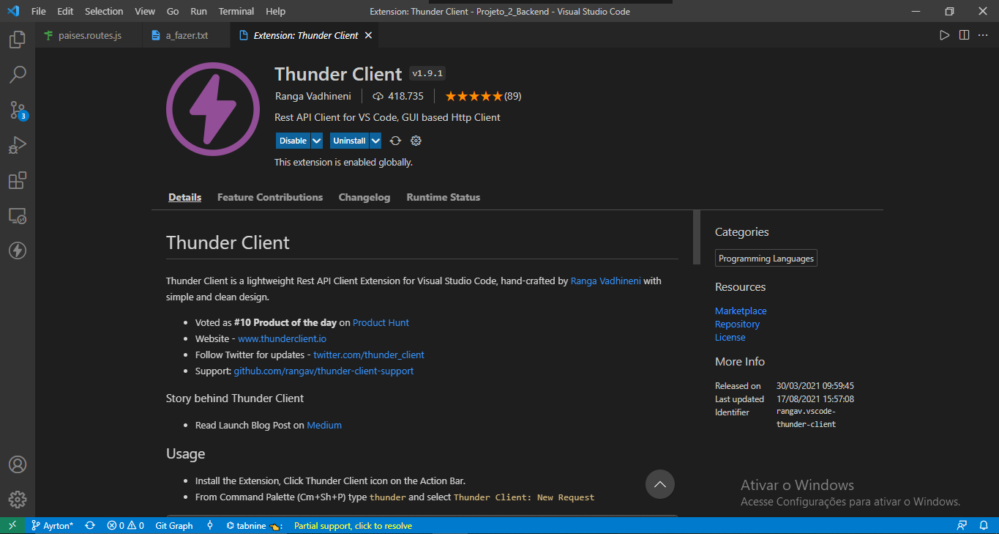

# Projeto_2_Backend
Projeto de API, que tem a função de salvar os dados de Países, Estados e Cidades em banco de dados, utilizando NodeJs, MongoDB Atlas e deploy na nuvem via Heroku.

## Introdução

Segundo projeto para avaliação do módulo 3 de Backend da Blue Ed Tech, onde criamos uma API com 3 rotas principais e 5 subrotas, totalizando o CRUD, conforme a tabela abaixo:

|  /países   |  /estados  |  /cidades  |
| :--------: | :--------: | :--------: |
|  /listall  |  /listall  |  /listall  |
| /listname/ | /listname/ | /listname/ |
|  /create   |  /create   |  /create   |
|  /update/  |  /update/  |  /update/  |
|  /delete/  |  /delete/  |  /delete/  |

Cada uma dessas rotas será possível fazer uma alteração nos dados cadastrados, tanto os de exemplo já pré-cadastrados, quanto os que o usuário irá cadastrar na rota ***/create***.

## Utilizando a API

Para iniciar, é necessário abrir o Prompt de comando/terminal e inicializar os comandos abaixo:

```javascript
npm init
npm start
npm install dotenv
npm install express --save
npm install mongoose
```


Concluído as os passos para instalar os npms, para poder utilizar a API, será necessário usar programas como o Postman, Insomnia, ou o Thunder Client dentro do VS Code.







Para utilizar o Postman, você irá precisar acessar o link https://www.postman.com/ e criar uma conta ou, se preferir, baixar o software neste link aqui: https://www.postman.com/downloads/. Para mais detalhes de como utilizar essa aplicação, acesse https://learning.postman.com/docs/getting-started/introduction/.

O mesmo se aplica ao Insomnia; o link para download: https://insomnia.rest/download e o link para consultar a documentação para melhor entender seu funcionamento: https://docs.insomnia.rest/.

Já em relação ao Thunder, ele é uma extensão do VS Code, então, para utiliza-lá, vá até a aba Extensions (ou Extensão, se seu VS Code estiver em português) e digite "Thunder Client", provavelmente será a primeira opção da listagem. Clique no banner com o nome da extensão e irá aparecer uma janela, igual a última imagem de exemplo acima. Clique em Install (ou Instalar) e após instalar, clique em Able (caso já não esteja habilitado após a instalação). Pronto, já está pronto para testar nossa API.

### As Rotas

- A rota ***/listall***  são responsáveis por listar na tela todos os itens cadastrados no banco de dados.

  Ao passar os parâmetros URL onde está rodando a aplicação (no caso, via Heroku), a rota principal (que é ou ***/cidades***, ***/estados*** ou ***/paises***) e a subrota a qual quer acessar (***/listall*** ou ***/listname/*** ou ***/create*** ou ***/update/*** ou ***/delete/***), irá retornar todos os dados cadastrados no banco de dados, conforme exemplo abaixo:

  ```json
   {
      "_id": "618b1577d6154770799c1926",
      "Nome": "PG",
      "QtdBairros": 15,
      "Populacao": 200000,
      "Aniversario": "20",
      "__v": 0
    }
  ```

  

- A rota ***/listname/*** irão retornar um cadastro especifico, bastando colocar o nome da Cidade/Estado/País cadastrado após o último "/".

  

- A rota ***/update/*** atualiza, por meio do Id do item cadastrado, os dados. Ao usar a rota ***/listall*** tem-se o id logo no início do cadastro.

  ```json
  {
    "_id": "618b1f93b8bc900c4e773901",
    "Nome": "França",
    "Populacao": 1111,
    "Lingua_mae": "frances",
    "PIB": 11111,
    "__v": 0
  }
  ```

  

- A rota ***/delete/*** irá excluir o cadastro. Assim como a rota ***/update***, é necessário informar o id após o "/" para a API identificar qual cadastro deve excluir.

Se você estiver utilizando o Thunder Client, no repositório tem disponível as Collections (que são espécies de atralhos para evitar estar escrevendo as rotas todas as vezes) de cada rota, para facilitar a utilização delas. Basta importar as Collections (que estão salvas com arquivos .JSON) e as rotas principais estão separadas por pastas, cada pasta contém as 5 rotas do CRUD.

Caso utilize o POSTMAN ou Insomnia, o link do projeto para utilizar a API é https://m3-backend-projeto2.herokuapp.com/.
